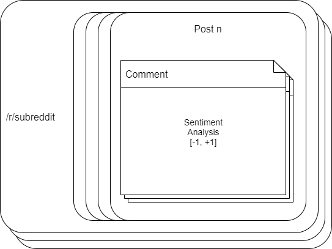
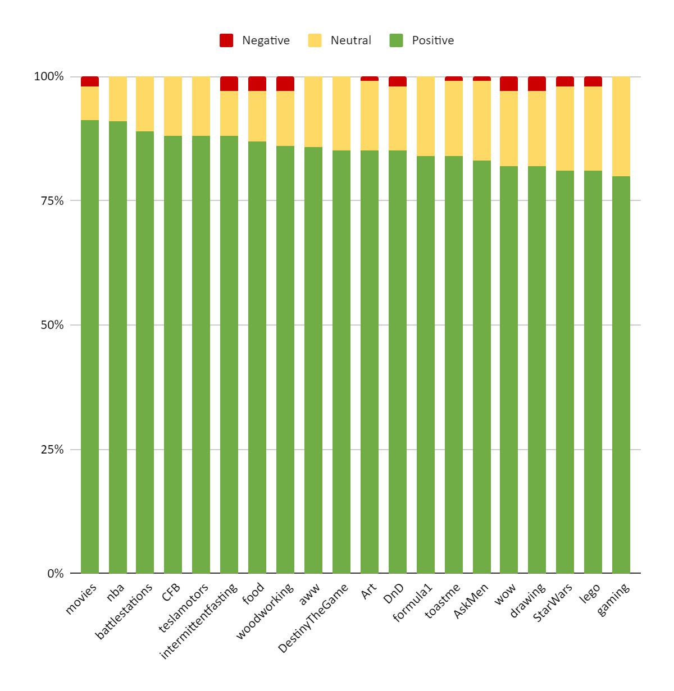
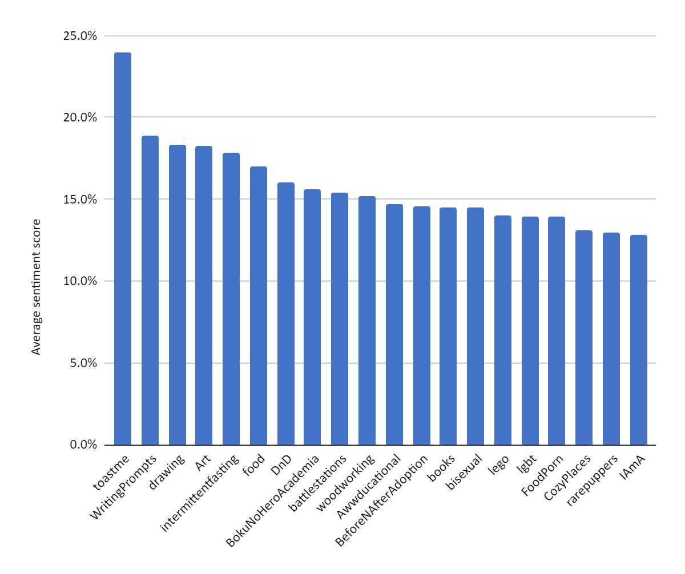
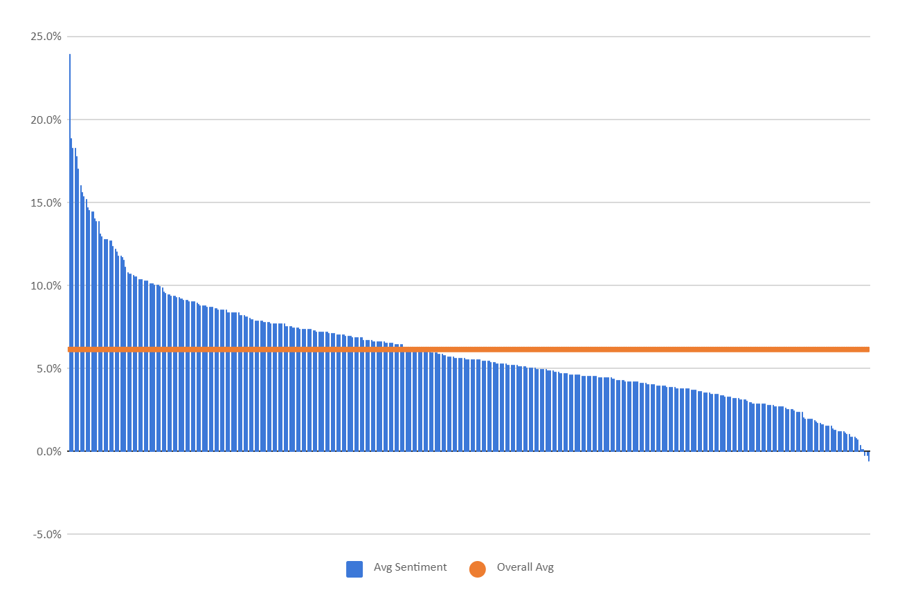

# Finding the Happiest Communities on Reddit

> This report was created as part of an assignment for Social Media Mining

* * *

## Introduction

This paper explores the happiness (measured as positivity of sentiment in comments) of various communities (called subreddits) on Reddit to determine which one can be considered the highest in happiness by two main metrics:

1.  Highest average per-post sentiment
2.  Highest percent of overall positive posts vs overall negative posts

Reddit often has a reputation for promoting hate-speech and being an overall toxic place \[1\], even by its creators \[2,3\] and I think it is important that the metrics of what an average user (or user with no account) who only looks at more popular subreddits (and not niche subreddits with a more fringe view) be measured to determine what subreddits are the most happy, as well as answering side questions such as what the overall sentiment of comments on Reddit is. The goal of this research is not to confirm or deny whether or not Reddit has toxic communities, but to determine happiness in popular communities for a representation of what most users are exposed to, and by extension how much positivity or negativity the average user is exposed to.

* * *

## Methodology

Finding the happiest community on Reddit will be achieved via sentiment analysis of all individual comments in a post. This should yield the average sentiment of a given post. Each post’s average user sentiment is counted as a single unit and stored in a file. The posts are selected from the top 100 posts to a given subreddit for the last week to get both a large dataset and wider timeframe of posts. For each of these groups of posts for a given subreddit, the average for the entire subreddit’s dataset was calculated and stored  in a different file. The subreddits were selected from those that appear in the top 1000 posts for a given day, measured over 3 days.

Figure 1 shown below shows how subreddits are made up of sets of posts, each of which is made up of sets of sets of comments to be analyzed. It also shows how the sentiment analysis tool used, TextBlob, produces a value between -1 and +1 inclusive. It also shows how all the comments can be collected together to form averages as well as posts being collected into subreddit scores.

Figure 1 - Visual explanation of how the data is collected and grouped

### Justification

The term happiness is considered to be the most positive as calculated by TextBlob sentiment analysis.

The subreddits measured must be a subset consisting of more popular subreddits for the current time-period of all subreddits on Reddit because:

1.  Reddit consists of over 1.7 million subreddits as of December 2019 \[3\] and even if it was possible to easily measure them all (see point 2), not all subreddits are of any consequence because smaller ones may be more susceptible to outliers in the data (point 3).
2.  Based on Reddit’s structure of only popular posts being shown on /r/all (the pseudo-subreddit that aggregates posts from all subreddits on the website), less popular subreddits are unlikely to appear
3.  Smaller communities are more influenced by individual users or posts, and the results become more skewed by a single outlier. This is combated by setting a target of 100 posts per community. Smaller communities cannot reach even close to this target within a week’s work of posts

Data must be reflective of the current sentiment within a community as subreddits may be currently very positive but have been overwhelmingly negative in the past or vice versa.

## Results

(See attached data in appendix for links to raw data and brief explanation)

As mentioned above, the dataset was initially meant to be from the top 500 posts of each day, but after 3 days I noticed that the data included single posts from various subreddits that had much higher sentiment than average, and as the data was grouped by subreddit, these single posts catapulted their respective subreddits to the top. I then decided to use the subreddits of these posts as the selection of subreddits to sample the top 100 posts of the week for. Doing this meant that only subreddits a normal user might see was selected but also gave a wide range in subreddit popularity (Ranging from less than 50,000 subscribers to over 24,000,000 subscribers).

This dataset can be considered reflective of what many users see but as users can completely control what subreddits they see or do not see, the experience users may have will vary greatly. This research makes no effort to isolate the most negative subreddits and cannot give a range or expectation as a result of this.

### Summary

Subreddit with the Most Overall Positive Posts: /r/movies

Subreddit with the Highest Average Sentiment of All Posts: /r/toastme

#### Statistics about the dataset

469 Subreddits Sampled (Subscriber count range: \[49315, 24321837\])

39146 Posts Sampled

3 sets of 1-2 hour runs over 3 days to get the subreddit list

14 hours of code runtime to analyze the top 100 posts from each of these subreddits

### Subreddit with the Most Overall Positive Posts

By this metric /r/movies is the most positive as it has the most overall positive posts of the dataset. Positive has been defined as having an average sentiment over 5%, neutral being less than 5% but more than -5% average sentiment, and negative being defined as less than -5% average sentiment

It should be noted from Figure 2 below that /r/nba looks like it is more positive than /r/movies. /r/movies actually has a slightly higher share of positive posts but /r/nba has the least negative posts (a tie of 0% with 8 other subreddits, however it has the most positive posts of the grouping).

Figure 2 - Top 20 most positive subreddits by share of positive posts vs negative posts

Subreddit with the Highest Average Sentiment of All Posts
---------------------------------------------------------

By this metric, /r/toastme is clearly the most positive as its average sentiment is 24.0%. The second place, /r/WritingPrompts has an average sentiment of 18.9% and the results get closer together as you move down through the ranks.

Below in Figure 3, it can be seen that there is a generally linear trend but /r/toastme breaks away as the most positive by a clear margin.

Figure 3 - Top 20 most positive subreddits ranked by highest average sentiment of all posts

The overall trend for all measured subreddits, shown in Figure 4 below (unlabeled but ordered by rank), shows an overall positive sentiment among comments and shows how only a select few subreddits have a significantly higher than average level of positivity. This also shows how very few of the subreddits measured are actually overall negative.

Figure 4 - Ranking all measured subreddits by average sentiment among all comments

### Other Interesting Results and Statistics

Lowest average sentiment (for all posts measured): /r/beetlejuicing (at -0.6%)

Highest share of overall negative posts: /r/VaxxHappened (at 22% negative)

* * *

## Discussion

### Consensus with Reddit

It seems like Reddit mentions many subreddits that appear in the top 20 as predominantly happy such as /r/wholesomememes \[4\] but it is worth mentioning that many subreddits did not end up in the data selected from top posts on /r/all. I believe that this is due to subreddits having fluctuations in popularity among users (IE going viral). This is not backed by scientific source but an observation as a casual user that every now and then sees a few posts from a subreddit all over the place and then it’s gone as fast as it came, almost as if it is a meta-meme.

### Conclusions

I consider the results significant as it clearly shows a separation of different types of positivity on Reddit: frequency of positive posts, overall average positivity in a given comment, least likelihood to see a negative comment section in a post, etc. Comparing across the two main categories, it is worth noting that /r/Art appears the highest overall, despite not placing first in either category.

Regarding the category of most overall positive posts, the result is not overly surprising. I wouldn’t have expected /r/movies to have the highest share of positive posts but based on their rules \[5\], particularly against antagonizing other users and remaining civil, it becomes very understandable how the sentiment of comments that remain on posts would be higher. I think that this shows that meaningful moderation leads to more positive communities.

As for overall average sentiment, /r/toastme is completely understandable as the clear leader. The entire purpose of the subreddit is to give compliments \[6\]. The second place winner /r/writingprompts having a high sentiment must be due to replies complementing users on their stories.

* * *

## Appendix

### Third-Party Packages Used

This list does not list packages required by any of those listed below and does not include packages in the Python Standard Library as it is assumed all of those who wish to recreate the results will have those already installed.

#### TextBlob

Used for sentiment Analysis for user-submitted comments

#### PRAW (Python Reddit API Wrapper)

Streamlines the access to the official Reddit API for data gathering

## Raw Results From Code

|Filename | Description |
|---------|-------------|
|collected\_data.csv (available on GitHub) | Original code run for collecting data. Results regarding the sentiment analysis ended up being discarded as abnormally popular posts from certain subreddits, particularly those pornographic in nature, gave the subreddits really high average sentiment scores that was unrepresentative of the subreddit’s true positivity. The set of unique subreddits that appeared in this file ended up being used as a list of subreddits to examine the top 100 posts of the week from.|
|subreddit\_collected\_data.csv (available on GitHub)| The second set of data collection and the basis for calculating the average sentiment of every comment on the subreddit.|
|subreddit\_collected\_data\_raw.csv (available on GitHub)| The raw results of every post examined during the second code run (uncombined form of subreddit\_collected\_data.csv). Used to calculate whether or not the post was positive, neutral, or negative. This was then used to show the distribution of positivity among subreddits.|

### External Links

Source code and data available at https://github.com/jonosellier/smm-fa19-final

## Sources Cited

\[1\] Why Reddit is Losing its Battle with Online Hate, Mother Jones, Retrieved 12/04/2019 from https://www.motherjones.com/politics/2019/08/reddit-hate-content-moderation/

\[2\] New Subreddits by Date, RedditMetrics, Retrieved 12/05/2019 from https://redditmetrics.com/history

\[3\] Dan McComas, Reddit Product SVP and Imzy Founder Interview, New York Magazine, Retrieved 12/03/2019 from http://nymag.com/intelligencer/2018/04/dan-mccomas-reddit-product-svp-and-imzy-founder-interview.html

\[4\] Looking For Happy Subreddits, Reddit /r/findareddit, retrieved 12/06/2019 from https://www.reddit.com//7seufl/

\[5\] Movie News and Discussion. Reddit /r/movies, retrieved 12/06/2019 from https://www.reddit.com/r/movies/

\[6\] Toast Me: You’re doing a great job, Here’s to you!. Reddit /r/toastme, retrieved 12/06/2019 from https://reddit.com/r/toastme
